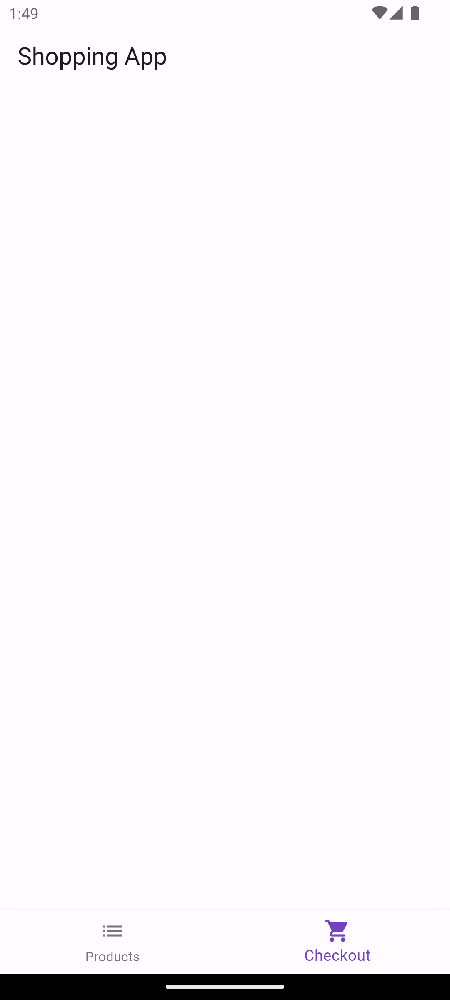
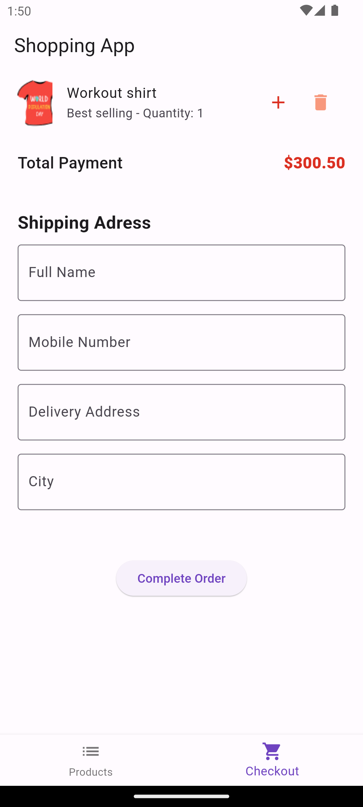

# shopping_app ReadMe

Shopping App is a shopping application that allows users to browse products, add items to a checkout cart, and complete orders. The app features a product listing screen, a checkout screen with the ability to add or remove items, and a success screen upon order completion.

## Table of Contents
-[Features](#features)
-[Installation](#installation)
-[Usage](#usage)
-[ProjectStructure](#project structure)
-[Contributing](#configuration)
-[License](#license)

## Features
Product Listing: Browse and search for products.
Add to Cart: Add products to the checkout cart.
Checkout: View and manage items in the checkout cart.
Order Completion: Navigate to an order success screen after completing the order.

## Installation
Follow these steps to install and run shopping app on your system.
Clone the repository:

bash
git clone https://github.com/shallom-dot/shopping_app.git
cd shopping_app
Install dependencies:

bash
Copy code
flutter pub get
Run the app:

bash
Copy code
flutter run

## Usage
Browse Products: On the product listing screen, browse the available products. Use the search bar to find specific items.
Add to Checkout: Tap on a product to add it to the checkout cart.
View Checkout: Navigate to the checkout screen to see all items added to the cart. You can increase quantity or remove items.
Complete Order: On the checkout screen, fill in the shipping address and complete the order to navigate to the success screen.

## Project Structure
lib
├── main.dart
├── screens
│   ├── product_screen.dart
│   ├── checkout_screen.dart
│   ├── order_success_screen.dart
│   ├── home_screen.dart
├── widgets
│   ├── discount_offers_widget.dart
│   ├── shipping_address.dart

main.dart: Entry point of the application.
screens/: Directory containing screen widgets.
product_screen.dart: Displays the product listing.
checkout_screen.dart: Displays the checkout cart.
order_success_screen.dart: Displays the order success message.
home_screen.dart: Main screen with bottom navigation bar to switch between products and checkout screens.
widgets/: Directory containing reusable UI components.
discount_offers_widget.dart: Custom widget to display discounted products.
shipping_address.dart: Widget for entering the shipping address.

## Screenshots

## Contributing
Contributions are welcome! Please follow these steps to contribute:

Fork the repository.
Create a new branch (git checkout -b feature-branch).
Make your changes.
Commit your changes (git commit -m 'Add some feature').
Push to the branch (git push origin feature-branch).
Open a pull request.
## License
This project is licensed under the MIT License. See the LICENSE file for details.

